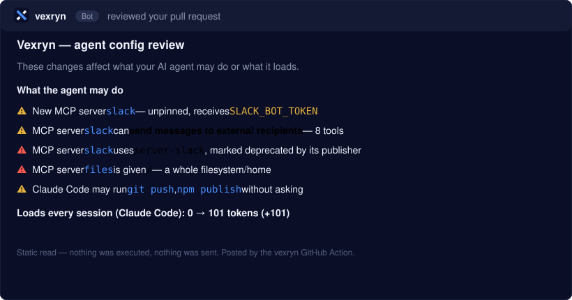

# vexryn

**See what your AI coding agent actually loads — and what it can do.** One
command, any repo, no config. Read-only, 100% local, nothing is sent.

[](https://www.npmjs.com/package/vexryn)
[](LICENSE)


```bash
npx vexryn scan
```


Your agent already loaded instruction files, skills and MCP servers before you
typed a word — and any config change can quietly hand it new powers: a server
holding a token, a tool that can send messages or run shell commands, a package
its publisher abandoned. Those configs are scattered across formats and code
review has no opinion on them. Vexryn reads them — Claude Code, Cursor, VS Code,
GitHub Copilot, Codex, Gemini, Windsurf, Cline, Roo, Continue, Zed, Kiro,
OpenCode, Goose — and tells you, in plain words, what each agent loads and what
its tools can do. It reads configs, never your code, and never runs a server.

## Why it's different

- **It reads every agent, in its own format** (JSON, TOML, YAML) — not just one.
- **It says what tools can do**, from a public catalogue of measured servers:
  *send messages, read files, run commands, delete records* — and flags the
  dangerous combinations (read the web + read your files + send them out).
- **It reviews a pull request.** `vexryn diff` turns an unreadable config diff
  into one comment: *new server `slack` receives `SLACK_BOT_TOKEN`, unpinned ·
  Claude Code may run `git push` without asking · +2,300 tokens every session.*
- **Nothing is sent, nothing is executed, no numbers are invented.** An
  unmeasured server says so. Safe for CI and untrusted repos.

## The road (perf → review → proof)

1. **Load report (here).** `vexryn scan` — a lean, faster agent in one command.
2. **PR review (built — CLI + GitHub Action).** `vexryn diff` turns an
   unreadable agent-config diff into a short comment: *"new MCP server `slack`
   receives `SLACK_BOT_TOKEN`, version not pinned · Claude Code may run
   `git push` without asking · +2,300 tokens every session."* A hosted GitHub
   App comes later, when a team needs it.
3. **Proof on demand (moat).** When a capability is genuinely dangerous, prove
   it's exploitable in a sandbox — never just flag it.

## Status

Early release — [`vexryn` on npm](https://www.npmjs.com/package/vexryn) (0.3.0). What's real today:

- **Every coding agent (agnostic):** finds and reads the MCP servers of Claude
  Code, Claude Desktop, Cursor, VS Code / GitHub Copilot (VS Code + CLI), Codex,
  Gemini CLI, Windsurf, Cline, Roo Code, Continue, Zed, Kiro, OpenCode and Goose —
  from each one's own format (JSON, JSONC, TOML, YAML), in the repo and user-wide.
  Read-only. Paths and formats are documented, with sources, in
  `docs/research/2026-09-26-agent-matrix.md`.
- **User-wide configs (default):** also reads each agent app's global config —
  Claude Code `~/.claude.json` (user scope + this repo's local scope), Claude
  Desktop, Cursor `~/.cursor/mcp.json`, Windsurf, Gemini CLI, VS Code user
  `mcp.json` (JSONC ok). That's usually where most of an agent's load lives.
  Read-only; `--no-global` restricts to the repo (e.g. in CI).
- **Per-agent load:** each agent app has its own context window, so load is
  reported per agent, never summed across apps. A server declared at several
  scopes of one agent is counted once (narrowest scope wins, like Claude Code).
- **Claude Code's always-loaded context (default, exact):** what Claude Code
  loads at every session start, per its docs
  ([context window](https://code.claude.com/docs/en/context-window)): CLAUDE.md
  files (repo root + parents + `~/.claude/CLAUDE.md`), auto memory `MEMORY.md`
  (first 200 lines / 25KB), skill descriptions (user, repo, enabled plugins —
  not `disable-model-invocation` ones) and subagent descriptions. Real tokens,
  read from disk, nothing executed. On a typical setup this — not MCP — is the
  biggest fixed load.
- **MCP tool search aware:** Claude Code defers MCP tool schemas by default
  (only names load up front), so their cost isn't counted as up-front load
  unless `ENABLE_TOOL_SEARCH=false` / a custom `ANTHROPIC_BASE_URL` turns
  deferral off. MCP servers shipped by enabled plugins are listed too.
- **No invented numbers:** the static path never executes a server and never
  guesses its cost — an unmeasured server says *not measured*. Safe for CI /
  untrusted repos.
- **Real measurement (`--deep`, agnostic):** connects to your OWN configured
  servers locally, reads their real tool list, and counts real tokens with
  `gpt-tokenizer`. Works for ANY server. Opt-in, launches
  the servers' commands on your machine, nothing is sent.
- **Powers (exact):** from a server's real tool list, Vexryn says in plain
  words what its tools can do — *can: send messages to external recipients,
  read files, run commands or code* — with a deterministic classifier: the
  tool's NAME decides (its verb and object: `read_file`, `slack_post_message`,
  `exec_in_pod`), an argument shape must agree, unsure = not listed. Tuned on
  the 543 real tools of the catalogue run. Never from a package name alone.
- **The Vexryn catalogue:** popular MCP servers (npm + PyPI) measured by a
  public GitHub Actions job — ephemeral VM, dummy credentials, read-only token,
  never on anyone's machine — and shipped as `catalog/catalog.json`: tool
  count, token cost, powers, traps and a hash per tool, **never descriptions**.
  Every entry links to the run that measured it. A static `scan`, the PR
  review and the MCP tools use it: a config's `npx -y <pkg>@<ver>` or `uvx
  <pkg>` gets real, dated figures without running anything (the pinned
  version, or the latest measured one when the config isn't pinned; a pinned
  version the catalogue lacks borrows nothing). Also says when a package is
  *marked deprecated by its publisher* — a dozen once-standard servers are.
- **Traps in tool descriptions:** a tool whose description carries
  instruction phrases (`<IMPORTANT>`, *before using this tool*, *do not tell
  the user*) or invisible characters is flagged — the phrases only, never the
  description; and to an agent (MCP), counts only, so the trap is never relayed.
- **Dangerous combinations:** per agent, across its MCP tools — *can read web
  pages, read your files and send them out* (a page it reads could tell it to
  send your files), *can read web pages and run commands or code*. Built-in
  tools aren't counted, and the line says so.
- **Remembered measurements + drift:** `--deep` results are kept locally
  (`~/.vexryn/measured.json`); the static `scan`, the MCP tool and `trim` then
  show real, dated figures without launching anything, and the next `--deep`
  says what changed: *+1 tool since 2026-09-25: `delete_record` · 1 tool
  changed its description or schema*.
- **HTML report (`--html`):** writes a shareable `.vexryn/report.html`.

- **Real usage (`vexryn wrap`, agnostic):** a transparent MCP proxy. Route a
  server through it and Vexryn counts the tool calls the agent actually makes —
  any agent, any server, precise, local. `vexryn scan` then shows *"you used 2
  of 5 tools"*. See it with `vexryn usage`.

- **Auto-wiring (`vexryn wire` / `unwire`):** routes a repo's stdio servers
  through the proxy, reversible, with a backup.
- **Trim (`vexryn trim [--write]`):** uses real usage to suggest what to cut and
  writes a lean config under `.vexryn/suggested/` (originals untouched). With a
  measurement it goes per tool: *keep `github` — 12 of 46 tools used; never
  used (34): …*.

Not built yet (honest):
- **Wiring user-wide configs** — read-only for now (Claude Code rewrites
  `~/.claude.json` while it runs), so usage/trim only cover repo-level servers.
- **Not visible from config files:** the agent's built-in system prompt, hook
  output (e.g. SessionStart hooks), slash-command files, and connectors added
  through an app UI (claude.ai / desktop) rather than a config file.
- **Catalogue coverage:** 41 of the 51 servers listed in `catalog/servers.json`
  start with dummy credentials; the others need a real account or database
  and are simply absent (never estimated). Powers cover 12 classes; database
  writes, publishing to GitHub or a CRM, and cloud resources aren't classes yet.
- **Proof of exploitability** — showing a dangerous combination can really be
  abused, in a sandbox — is the next step, not built.
- **Instruction loading** is counted for Claude Code, Cursor, Windsurf, Gemini CLI,
  Codex, OpenCode, Kiro, Cline, Roo and Zed. GitHub Copilot, Continue and Goose
  are read for MCP servers only; their instruction files are named in a review but
  not yet load-counted.
- **Usage per launch command** — `wrap` records calls under the server *name*
  the agent uses, not its launch command, so a name reused for a different
  server in another repo mixes their counts in `trim`.
- **Powers in the PR review** — the diff only holds a launch command, so
  "adds 8 tools, can send messages" needs a measured catalogue
  (package@version → tools). Not before it exists.

## PR review (`vexryn diff`)



See it on a real pull request: [yl0n0ps/vexryn-scan#1](https://github.com/yl0n0ps/vexryn-scan/pull/1).

```bash
vexryn diff --base main            # what my uncommitted/branch changes do
vexryn diff --base <sha> --head <sha>
```

Compares two versions of the repo's agent configs and prints one markdown
comment: **what the agent may now do** — MCP servers added/removed/changed
(launch command or URL, unpinned `npx`/`uvx` packages, the *names* of the env
vars/headers they receive — never values), Claude Code permission rules,
permission mode, extra directories, hooks, plugins — and **what Claude Code now
loads every session** (token deltas — counted with the o200k tokenizer, an
approximation of the model's own count — and skills/subagents by name). Every
changed agent file is named, including ones it doesn't review yet (`AGENTS.md`,
Cursor rules…), so a change is never reported as "no change".

Static: files are read from git objects as data, never executed; a symlinked
`CLAUDE.md` is followed one hop inside the repo, never outside. Every string
from the repo is rendered inside a code span, so a hostile server name can't
inject links or @mentions, and likely secrets in commands, URLs and hooks are
masked. Exits 0 whatever it finds — it informs, it doesn't block (1 on a git
error, 2 on a usage error).

**Exact rules, no AI judge.** On a server the change adds or modifies, the
review states: a credential written in the file (named, never shown — use
`${VAR}`), a shell launched with inline code or a pipe, a whole filesystem or
home or a credential path handed to it, plain `http://` to a remote host, a
credential inside its command or URL, a long encoded argument; and a server
name now defined in two files with different commands. On any agent file the
change adds text to — including ones not reviewed for load, like `AGENTS.md`
or Cursor rules — it counts invisible characters (zero-width, bidi, tag) and
quotes phrases such as "ignore previous instructions" or "do not tell the
user", reported as *contains the phrase*, never as malicious. An issue already
present and unchanged is never repeated. `vexryn scan` shows the same server
facts under each server.

In CI, the GitHub Action posts it as a single comment it keeps up to date
(on a fork PR, whose token is read-only, it writes to the job summary instead):

```yaml
# .github/workflows/vexryn.yml
on: pull_request
permissions:
  contents: read
  pull-requests: write
jobs:
  agent-config-review:
    runs-on: ubuntu-latest
    steps:
      - uses: actions/checkout@v4   # pin to a commit SHA in real use
        with:
          fetch-depth: 2            # the merge commit + the base it compares to
      - uses: yl0n0ps/vexryn-scan@main  # pin to a commit SHA in real use
```

With the catalogue, a server the change adds says what it can do: *⚠️ MCP
server `slack` can send messages to external recipients — 8 tools (Vexryn
catalogue: `@modelcontextprotocol/server-slack@2025.4.25`, measured …)*, plus
its publisher's deprecation, traps in its tool descriptions, and any dangerous
combination the change creates for an agent. The load of **Cursor** (always-apply
rules, rule descriptions, root `AGENTS.md`), **Windsurf** (global and always-on
rules, `.windsurfrules`, root `AGENTS.md`) and **Gemini CLI** (`GEMINI.md` or its
`context.fileName`) is counted when the agent is present, per their docs.

**Accepted findings.** Every ⚠️ line ends with an id (`vx-1a2b3c4d`). List it in
`.vexryn.json` at the repo root to stop hearing about a risk you've accepted:

```json
{ "accept": [{ "id": "vx-1a2b3c4d", "reason": "throwaway VM, whole disk on purpose" }] }
```

It is read from the **base** branch only: a pull request can't silence its own
findings (it gets a ⚠️ line saying how many it accepts instead).

Not reviewed yet (honest): slash-command files, a server's tools when it isn't
in the catalogue (unknowable without running it), `.cursorrules` (no longer
documented).

## Use it from your agent (`vexryn mcp`)

The same things, as three read-only MCP tools your own agent can call
mid-conversation: `agent_load_report` ("what do you load?"),
`agent_config_review` ("review my agent-config change") and
`mcp_server_lookup` ("what can this MCP server do before I add it?" — from the
catalogue, nothing launched). Works with any MCP client (Claude Code, Cursor,
Windsurf, Gemini CLI…).

```json
{ "mcpServers": { "vexryn": { "command": "npx", "args": ["-y", "vexryn", "mcp"] } } }
```

(From a checkout instead: `"command": "node", "args": ["<path>/vexryn-scan/dist/cli.js", "mcp"]`.)

**Read-only by construction.** Nothing that edits a config (`wire`,
`trim --write`), sits in a server's path (`wrap`) or launches servers
(`--deep`) is exposed: an agent must never be able to widen its own powers
through Vexryn — that's the exact blind spot Vexryn exists to show. Paths are
confined to the directory the agent started Vexryn in. Secrets are masked as in
`vexryn diff`. Honest note: this adds three tool names to your agent's context
(Claude Code defers their schemas; other clients load them) — a small,
deliberate cost.

## Test

```bash
npm test   # global configs, wire round-trip, proxy + usage + trim, Claude Code
           # context, settings, git snapshots, diff review, the Action's comment
           # script (fake gh), power classifier, remembered measurements + drift,
           # per-tool trim — all in temp dirs / a fake home (VEXRYN_HOME);
           # your real configs are never touched, nothing reaches GitHub
```

## Develop

```bash
npm install
npm run build
node dist/cli.js scan ./fixtures/sample-repo            # static (read-only)
node dist/cli.js scan ./fixtures/deep-repo --deep       # real introspection
node dist/cli.js scan ./fixtures/sample-repo --html     # + .vexryn/report.html

# Wire a real server through the proxy in your own .mcp.json:
#   "command": "vexryn", "args": ["wrap", "--name", "github", "--",
#                                  "npx", "-y", "@modelcontextprotocol/server-github"]
```

## Architecture (decided by the bricks, not habit)

- **Front: TypeScript/Node** — where the bricks live (official MCP SDK,
  token counting, Probot for the GitHub App) and where `npx` distribution is
  frictionless.
- **Depth (later): external subprocesses** — Semgrep (rules), microsandbox
  (safe proof), and the existing Rust proof engine, invoked only for the rare
  "prove it" path. Open feed on OSV, provenance via Sigstore.

See the design doc: *Vexryn — Conception produit*.
